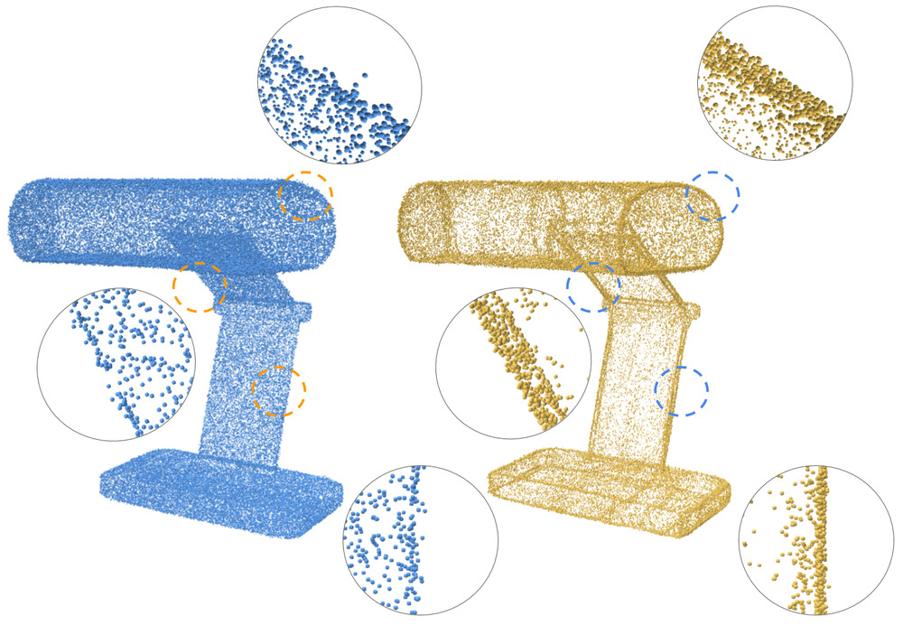

# Self-Sampling - for neural point cloud consolidation

We introduce a novel technique for neural point cloud consolidation
which learns from only the input point cloud.

### TOG 2021 (Provisionally accepted) [[Paper]](https://arxiv.org/abs/2008.06471) [[Project Page]](https://galmetzer.github.io/self-sample/)<br>
by [Gal Metzer](https://galmetzer.github.io/), [Rana Hanocka](https://www.cs.tau.ac.il/~hanocka/), [Raja Giryes](http://web.eng.tau.ac.il/~raja), and [Daniel Cohen-Or](https://danielcohenor.com/)

# Getting Started

### Installation
- Clone this repo:

#### Setup Conda Environment
- Relies on [PyTorch](https://pytorch.org/) version 1.7.1 <br>
- [Pytorch Geometric](https://github.com/rusty1s/pytorch_geometric) 
- Everything can be installed via conda environment `conda env create -f env.yml` (creates an environment called self-sample)
  
# Running Examples
The demos folder contains examples from the paper.<br>
For each shape the demo runs the optimization and inference parts. <br>
For instance, to run the lamp demo simply execute from the root project folder: 
```
demos/lamp.sh
```

The results would be found at `demos-results/lamp/lamp_result.xyz`,
</br>
and respectively for the other shapes as well.

#### Example shapes

- alien, anchor, lamp - sharp point consolidation
- candle, scanned Leg, tiki - sparse point consolidation
- camera_noised - denoising 


# Citation
If you find this code useful, please consider citing our paper
```
@article{metzer2020self,
  title={Self-Sampling for Neural Point Cloud Consolidation},
  author={Metzer, Gal and Hanocka, Rana and Giryes, Raja and Cohen-Or, Daniel},
  journal={arXiv preprint arXiv:2008.06471},
  year={2020}
}
```

# Questions / Issues
If you have questions or issues running this code, please open an issue.

Note: the original implementation used [this implementation](https://github.com/erikwijmans/Pointnet2_PyTorch)
of PointNet++, which is not guaranteed to supported newer versions of pytorch. 
</br>
This implementation uses [Pytorch Geometric](https://github.com/rusty1s/pytorch_geometric) instead,
which can not hold large subsets at train time.

Therefore, demos are designed for subset sizes lower than used in the paper.
Increasing the subset size to 12K-14K on an appropriate GPU, improves the accuracy of the results.
